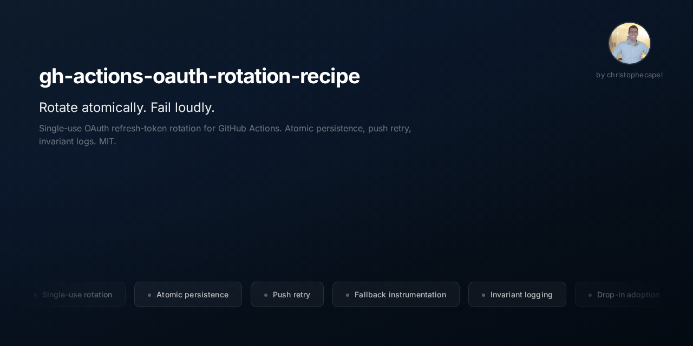

> Keep your Strava, Oura, Whoop, or Spotify GitHub Actions integration running for months without babysitting it.

If you pull data from a fitness or music API on a schedule, there's a failure waiting for you that no tutorial warns about: most of these providers hand out **single-use login tokens that rotate on every call**. Miss one rotation, even once, and your integration goes dark silently. No error in your inbox. You find out days later when the data just stopped arriving.

This is a drop-in recipe that keeps the chain alive: token rotation, automatic push retry, and a log line that surfaces the moment something silently breaks. Hardened over **three months of daily production use**, part of 2,000+ contributions building in public.

It works today for any provider that issues single-use, rotating refresh tokens — Strava, Whoop, Oura, Spotify, and others.

> **Note on Fitbit + Google Health.** The original incident behind this recipe was on the Fitbit Web API, which is being deprecated in favour of the [Google Health API](https://developers.google.com/health/migration) (legacy turndown September 2026, moving to Google OAuth 2.0). New Fitbit-style integrations should plan for that migration. The single-use rotation pattern here applies to the providers above regardless; a tested Google Health / Google OAuth 2.0 variant is on the [roadmap](#roadmap).

## What's in the box

| File | What it does |
|---|---|
| `.github/workflows/rotation.yml` | Workflow yaml with the full pattern: refresh → persist → secret update → do work → commit + push with retry |
| `scripts/refresh_token.py` | Provider-agnostic OAuth refresh + atomic persistence to all sinks (file + secret) |
| `scripts/update_secret.py` | GitHub Actions secret update helper using pynacl (the easy-to-skip "fallback" wiring) |
| `docs/failure-modes.md` | What breaks if you don't do this — three concrete failure modes from a real incident |
| `docs/adoption.md` | How to add this to your repo — env vars, secrets, provider-specific gotchas |
| `tests/test_refresh.py` | Tests covering the happy path, the abort-on-persistence-failure path, and the fallback path |

## When to use this

You need this recipe if **all** of these apply:

1. You're running a GitHub Actions workflow that consumes an OAuth API (Strava, Whoop, Oura, Spotify, Notion, Hubspot, and others)
2. The API provider issues **single-use refresh tokens** with rotation (most modern providers do)
3. You want the workflow to keep running unattended for weeks or months

If your API uses long-lived static tokens, you don't need this. If your access tokens last days, you don't need this. The recipe earns its keep when:

- Refresh tokens are single-use and rotate on every exchange
- The chain can break silently if any rotation is lost
- You can't afford to babysit the integration

## Quick start

One command (clone, then scaffold into your repo):

```bash
git clone https://github.com/christophecapel/gh-actions-oauth-rotation-recipe.git
cd gh-actions-oauth-rotation-recipe
./install.sh /path/to/your-repo --with-tests
```

Or copy the files by hand. Either way, three steps to live:

1. **Get the files in** (the installer copies `.github/workflows/rotation.yml`, `scripts/refresh_token.py`, `scripts/update_secret.py`; `--with-tests` adds CI + tests)
2. **Set five secrets** in your repo's Actions settings (see `docs/adoption.md`)
3. **Adapt the workflow yaml**: change `git config user.email`, replace the "Do work" placeholder step with your actual API calls

Install options + manual steps in [`install.md`](install.md); full walkthrough in [`docs/adoption.md`](docs/adoption.md).

## Why this recipe exists

> Nine weeks of green workflow runs. Then a single transient `Internal Server Error` on a `git push` lost a freshly-rotated refresh token. The runner discarded its filesystem; the repo stayed at the previous (now-consumed) token. Three days of dead-token-cascade followed. Worse: the script had a "fallback to GitHub secret" recovery path written. It required `GH_PAT` in the env. The workflow yaml had never piped `GH_PAT` in. The fallback had been silently no-op since the day it was added.

Three failure modes, all real, all in `docs/failure-modes.md`:

1. **Single-use refresh tokens** + ephemeral GitHub Actions runners = chain breaks if any rotation isn't pushed back to the repo
2. **Transient GitHub push 500s** lose freshly-rotated tokens unless you retry the push
3. **Recovery paths that have never fired** silently no-op for months and don't help when you finally need them

The recipe addresses all three with concrete code.

## Companion project

The two lessons behind this recipe are codified in the free, open [`claude-mechanisms`](https://github.com/christophecapel/claude-mechanisms) catalog (MIT):

- [#9 Atomic credential persistence](https://github.com/christophecapel/claude-mechanisms/blob/main/mechanisms/09-atomic-credential-persistence.md): persist a single-use credential before doing anything else, or abort. The principle this recipe implements.
- [#23 Unit-test the parts, then end-to-end-test the whole](https://github.com/christophecapel/claude-mechanisms/blob/main/mechanisms/23-unit-test-parts-then-e2e-whole.md): a recovery path you've never run end-to-end is unverified. Why a silent failure can hide for weeks.

## Roadmap

- **v0.2 — Google Health API support.** The Fitbit Web API is migrating to the [Google Health API](https://developers.google.com/health/migration) (Google OAuth 2.0, legacy turndown September 2026). Google OAuth 2.0 has a different refresh model from the single-use providers above, so this needs its own tested path — not a drop-in rename. A variant covering Google OAuth 2.0 token handling will ship once the new API stabilises (Google advises against launching before end of May 2026 while breaking changes land). Built and verified against a live integration, not bolted on untested — that's the whole point of this recipe.

## Contributing

See `CONTRIBUTING.md`. Bug reports + provider-specific gotchas welcome.

## License

MIT.
